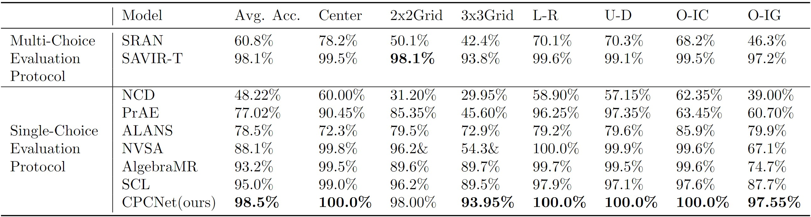

# 1. CPCNet

This repo hosts the source code of the paper [A Cognitively-Inspired Neural Architecture for Visual Abstract Reasoning Using Contrastive Perceptual and Conceptual Processing](https://arxiv.org/pdf/2309.10532.pdf).


This work introduce a new neural architecture for solving visual abstract reasoning tasks inspired by human cognition, specifically by observations that human abstract reasoning often interleaves perceptual and conceptual processing as part of a flexible, iterative, and dynamic cognitive process. Inspired by this principle, our architecture models visual abstract reasoning as an iterative, self-contrasting learning process that pursues consistency between perceptual and conceptual processing of visual stimuli. We explain how this new Contrastive Perceptual-Conceptual Network (CPCNet) works using matrix reasoning problems in the style of the well-known Raven's Progressive Matrices intelligence test. Experiments on the machine learning dataset RAVEN show that CPCNet achieves higher accuracy than all previously published models while also using the weakest inductive bias. We also point out a substantial and previously unremarked class imbalance in the original RAVEN dataset, and we propose a new variant of RAVEN---AB-RAVEN---that is more balanced in terms of abstract concepts.

# 2. Datasets
Datasets used in our experiments can be downloaded here:
* [RAVEN](http://wellyzhang.github.io/project/raven.html#dataset)
* [AB-RAVEN-160x160](https://drive.google.com/file/d/1tuVjVeYWSL8VwzyDb5MzOZKkvbUjIKnp/view?usp=sharing), [AB-RAVEN-80x80](https://drive.google.com/file/d/1ovmTXqvI83fb_NkI_U-xnGKMe_LrCGNv/view?usp=sharing)
* [I-RAVEN](https://github.com/husheng12345/SRAN)
* [RAVEN-FAIR](https://github.com/yanivbenny/RAVEN_FAIR)
* [PGM](https://github.com/google-deepmind/abstract-reasoning-matrices), need to be manually resized to 80x80 before training and testing.


# 3. Performance

The following four tables show the performance of various methods on the RAVEN, AB-RAVEN, I-RAVEN, and RAVEN-FAIR datasets. For more details, please check out our [paper](https://arxiv.org/pdf/2309.10532.pdf).

## 3.1. Accuracies on RAVEN


## 3.2. Accuracies on AB-RAVEN


## 3.3. Accuracies on I-RAVEN



## 3.4. Accuracies on RAVEN-FAIR


## 3.5. Accuracies on PGM-Neutral


# 4. Dependencies
Use **Conda** to manage packages:
* python 3.10.11
* cudatoolkit 11.8.0
* cudnn 8.6.0.163
* tensorflow 2.12.0
* See ```req.txt``` for a full list of packages required.


# 5. Usage
## 5.1. Train from scratch
Train from scratch with `train_from_scratch.sh`. Use `--mode train_multi_path` for two-classification-head models (`CPCNet, CPCNet_0_Contrasting_Layer, CPCNet_1_Contrasting_Layer, CPCNet_2_Contrasting_Layer, CPCNet_3_Contrasting_Layer, CPCNet_4_Contrasting_Layer`)
and `--mode train` for single-classification-head models (`CPCNet_UP, CPCNet_LP, CPCNet_IC, CPCNet_UC, CPCNet_LC`). For example: 
```
python main.py --mode train \
               --model CPCNet_UP \
               --channels 64 \
               --dataset RAVEN \
               --dataset-path /home/user/datasets/comparison-experiments/RAVEN-10000/ \
               --train-configs in_distribute_four_out_center_single \
                               distribute_nine \
                               distribute_four \
                               in_center_single_out_center_single \
                               left_center_single_right_center_single \
                               up_center_single_down_center_single \
                               center_single \
               --train-configs-proportion 1 1 1 1 1 1 1 \
               --image-size 80 \
               --epoch-num 2 \
               --batch-size 32 \
               --num-workers 2 \
               --learning-rate 0.0025 \
               --weight-decay 0.0 \
               --loss bce \
               --output-path /home/user/repo/CPCNet/results
```
and
```
python main.py --mode train_multi_path \
               --model CPCNet \
               --channels 64 \
               --dataset RAVEN \
               --dataset-path /home/user/datasets/comparison-experiments/RAVEN-10000/ \
               --train-configs in_distribute_four_out_center_single \
                               distribute_nine \
                               distribute_four \
                               in_center_single_out_center_single \
                               left_center_single_right_center_single \
                               up_center_single_down_center_single \
                               center_single \
               --train-configs-proportion 1 1 1 1 1 1 1 \
               --image-size 80 \
               --epoch-num 2 \
               --batch-size 32 \
               --num-workers 2 \
               --learning-rate 0.0025 \
               --weight-decay 0.0 \
               --loss bce \
               --output-path /home/user/repo/CPCNet/results
```

For training on PGM, the generalization regime needs to be specified:
```
python main.py --mode train_two_path \
               --model CPCNet \
               --channels 64 \
               --dataset PGM \
               --dataset-path /home/user/datasets/PGM-uint8-resized/ \
               --generalization-regime neutral \
               --dataset-portion 1.0 \
               --image-size 80 \
               --epoch-num 100 \
               --batch-size 64 \
               --num-workers 2 \
               --learning-rate 0.0005 \
               --loss bce \
               --output-path /home/user/repo/results
```

## 5.2. Train from a checkpoint
Train from a checkpoint with `train_from_ckpt.sh`. Similar with train from scratch but need to specify the checkpoint folder with `--output-path`. The training will continue from the last checkpoint in the folder. For example:
```
python main.py --mode train_multi_path \
               --model CPCNet \
               --channels 64 \
               --dataset RAVEN \
               --dataset-path /home/ryan/datasets/comparison-experiments/A-RAVEN-10000-resized/ \
               --train-configs in_distribute_four_out_center_single \
                               distribute_nine \
                               distribute_four \
                               in_center_single_out_center_single \
                               left_center_single_right_center_single \
                               up_center_single_down_center_single \
                               center_single \
               --train-configs-proportion 1 1 1 1 1 1 1 \
               --image-size 80 \
               --epoch-num 2 \
               --batch-size 32 \
               --num-workers 2 \
               --learning-rate 0.01 \
               --loss bce \
               --output-path /home/user/repo/results/2023_09_18_21_20_38_train_multi_path_CPCNet_ch_64_bs_32_dp_A-RAVEN-10000-resized_ls_bce_sd_2023
```
where the last line is the result folder generated by `training_from_sratch.sh`.

## 5.3. Test a checkpoint
Test with `test.sh`. Need to specify which checkpoint to be tested with `--ckpt-path` and the result will be store in the same dir as the checkpoint. For example:
```
python main.py --mode test_multi_path \
               --model CPCNet \
               --channels 64 \
               --dataset RAVEN \
               --dataset-path /home/user/datasets/RAVEN-10000/ \
               --ckpt-path /home/user/CPCNet/results/2023_09_18_21_20_38_train_multi_path_CPCNet_ch_64_bs_32_dp_A-RAVEN-10000-resized_ls_bce_sd_2023/model_ckpt/ckpt-4   \
               --image-size 80 \
               --batch-size 32 \
               --num-workers 2 \
               --loss bce

```
It is similar to training in that `--mode test_multi_path` should be used for two-classification-head models and `--mode test` should be used for single-classification-head models.

An example of testing on PGM:
```
python main.py --mode test_two_path \
               --model CPCNet \
               --channels 64 \
               --dataset PGM \
               --generalization-regime neutral \
               --dataset-path /home/user/datasets/PGM-uint8-resized/ \
               --ckpt-path /home/user/repo/results/2023_09_27_22_10_04_train_two_path_CPCNet_CL_ch_64_bs_64_dp_PGM-uint8-resized_ls_bce_sd_2024/model_ckpt/ckpt-$ii   \
               --image-size 80 \
               --batch-size 64 \
               --num-workers 2 \
               --loss bce
```

# 6. Citation

```
@misc{yang2023cognitivelyinspired,
      title={A Cognitively-Inspired Neural Architecture for Visual Abstract Reasoning Using Contrastive Perceptual and Conceptual Processing}, 
      author={Yuan Yang and Deepayan Sanyal and James Ainooson and Joel Michelson and Effat Farhana and Maithilee Kunda},
      year={2023},
      eprint={2309.10532},
      archivePrefix={arXiv},
      primaryClass={cs.AI}
}
```


